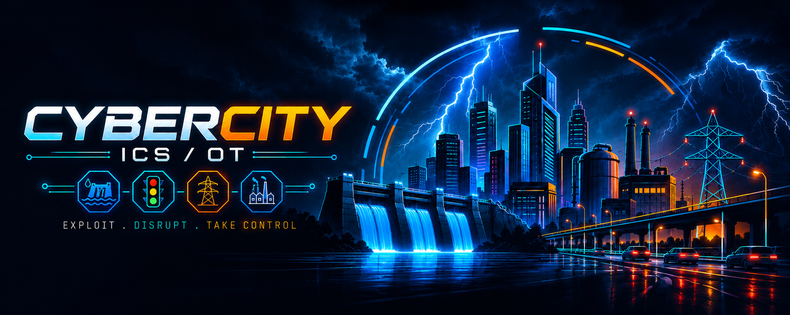
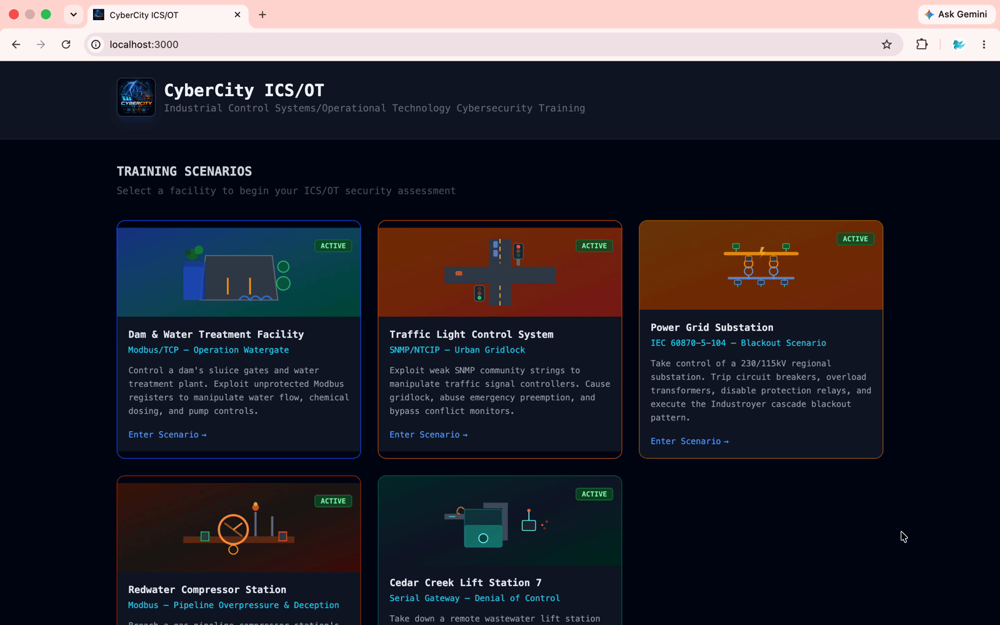

## CyberCity - ICS/OT Cybersecurity Training Platform

<p align="center">
  
</p>

<p align="center">
  
  
  
  
  
</p>

<p align="center">
  
  
  
  
</p>

<p align="center">
  
  
  
</p>

<p align="center"><strong>Industrial Control Systems / Operational Technology (ICS/OT) Cybersecurity Training Platform.</strong></p>

---

A scenario-based training lab where students learn to assess and exploit real-world industrial control systems. Each scenario simulates a different critical infrastructure facility with live physics, real ICS/OT protocols, and visual feedback.

<p align="center">🏭 <strong>Featuring at <a href="https://www.blackhat-india.com/arsenal-schedule#cybercity---icsot-cybersecurity-training-platform-60014" target="_blank" rel="noopener noreferrer">Black Hat India 2026 Arsenal</a></strong></p>

## 🎬 Demo



## 👥 Contributors

- Ashish Bhangale, Lead Security Researcher (R&D), [LinkedIn](https://www.linkedin.com/in/hax0rguy/)
- G Khartheesvar, Sr. Engineer (R&D), [LinkedIn](https://www.linkedin.com/in/g-khartheesvar/)
- Litesh Ghute, Sr. Engineer (R&D), [LinkedIn](https://www.linkedin.com/in/liteshghute/)

## 🎯 Scenarios

| # | Facility | Protocol | Port | Status |
|---|----------|----------|------|--------|
| 1 | **HydraGuard**: Dam & Water Treatment Plant | **Modbus/TCP** | 5020 | ✅ Active |
| 2 | **MetroGrid**: 4-Way Traffic Intersection | **SNMP v2c** (NTCIP) | 5021/udp | ✅ Active |
| 3 | **Northgate Substation**: 230/115kV Power Grid | **IEC 61850 MMS** | 5022 | ✅ Active |
| 4 | **Meridian Compressor Station 7**: Gas Pipeline | **DNP3** | 5023 | ✅ Active |
| 5+ | **More scenarios in development** | - | - | 🔜 Coming Soon |

---

### 🌊 Scenario 1: HydraGuard (Dam & Water Treatment)
**Protocol: Modbus/TCP** · Port 5020

Modbus is the oldest and most widely deployed ICS protocol (Schneider Electric, 1979). It has **zero built-in authentication**, anyone who can reach port 502 can read or write any register. Inspired by real incidents: Bowman Avenue Dam breach (2013), Oldsmar FL water treatment (2021).

**What you can do:**
- Read holding registers to map the entire physical process
- Write coils to open dam sluice gates and flood downstream
- Spike sodium hypochlorite dosing into lethal concentrations
- Kill pumps, force overflow, disable alarms

**Attack phases:**
1. **Reconnaissance**: `mbpoll` / `modpoll` to scan and enumerate registers
2. **Eavesdropping**: Capture cleartext Modbus frames with Wireshark
3. **Register Manipulation**: Direct coil/register writes to actuate physical devices

---

### 🚦 Scenario 2: MetroGrid (4-Way Traffic Intersection)
**Protocol: SNMP v2c** (NTCIP 1202) · Port 5021/UDP

SNMP (Simple Network Management Protocol) v2c uses plaintext **community strings** for auth, effectively a shared password sent in the clear. NTCIP 1202 is the US standard OID schema for traffic controllers. A 2014 University of Michigan study found ~100 real intersections exposed with default strings (`public` / `private`).

**What you can do:**
- Walk the OID tree to discover all controller variables
- Modify phase timing to cause gridlock and queue starvation
- Trigger Emergency Vehicle Preemption (EVP) to lock a direction green
- Disable the Conflict Monitor, the safety relay that prevents opposing greens

**Attack phases:**
1. **Discovery & Enumeration**: `snmpwalk -v2c -c public` to map all OIDs
2. **Timing Manipulation**: Write phase durations to disrupt traffic flow
3. **Emergency Preemption Abuse**: Force EVP to pin one direction
4. **Conflict Monitor Bypass**: Disable safety interlock, force simultaneous greens (mirrors TRISIS/Triton 2017 SIS attack pattern)

---

### ⚡ Scenario 3: Northgate Substation (230/115kV Power Grid)
**Protocol: IEC 61850 MMS** · Port 5022

IEC 61850 is the international standard for substation automation and protection relay communication. **MMS (Manufacturing Message Specification)** is the application-layer protocol used by Intelligent Electronic Devices (IEDs) to expose data objects using a strict logical node hierarchy (`LD/LN.DO.DA`). Most legacy IEDs have no authentication. This scenario mirrors the **Industroyer / Crashoverride** attack (Ukraine, December 2016) that caused a 1-hour blackout for 230,000 people.

**What you can do:**
- Read all IED data objects: CB states, bus voltages, transformer loading, protection relay status
- Disable all 5 protection relays (differential, overcurrent, under-frequency, auto-recloser)
- Trip all 7 circuit breakers in rapid succession
- Trigger thermal overload cascade on TX2 (200MVA) once TX1 is isolated
- Achieve total blackout: 190 MW lost across Industrial, Residential, and Critical zones

**Attack phases:**
1. **Recon**: `identify` + `get_name_list` to discover all logical nodes
2. **Telemetry**: `read_dataset DS_FULL` to snapshot live measurements
3. **Selective Tripping**: Trip individual CBs to isolate transformer feeders
4. **Industroyer Pattern**: Disable all protection → rapid CB trip sequence → block auto-reclosure → permanent blackout

---

### ⛽ Scenario 4: Meridian Compressor Station 7 (Gas Pipeline)
**Protocol: DNP3** · Port 5023

DNP3 has **no default authentication** — Secure Authentication (SAv5) exists in the standard but is almost never deployed in the field. This scenario mirrors **PIPEDREAM/INCONTROLLER** (CISA/NSA/FBI/DOE advisory AA22-103A, 2022), the most versatile ICS attack toolkit ever publicly documented, purpose-built to sabotage PLCs and safety controllers in gas/LNG and electric infrastructure — and **TRISIS/TRITON** (2017), which directly targeted a Schneider Electric Triconex Safety Instrumented System at a Saudi petrochemical plant. Unlike the other scenarios, this one goes beyond direct register writes: it models genuine **defense-in-depth** (an electronic safety system backed by an independent mechanical relief valve) and a **false-data-injection / telemetry-spoofing** attack that freezes the operator's HMI at "nominal" while the pipeline actually ruptures underneath — the same deception principle behind Stuxnet (2010).

**What you can do:**
- Enumerate the DNP3 outstation's full point map with a Class 0 integrity poll
- Overspeed the compressor and watch the Emergency Shutdown System (ESD) safely trip it
- Bypass the ESD **and** isolate the mechanical Pressure Relief Valve (defeating both defense-in-depth layers, TRISIS-style)
- Activate an undocumented telemetry-spoofing point so the Control Room shows frozen "nominal" readings
- Drive the pipeline to a catastrophic overpressure rupture the operator never sees coming

**Attack phases:**
1. **Reconnaissance**: DNP3 Class 0 integrity poll to enumerate every Analog/Binary Input/Output point
2. **Setpoint Manipulation**: Direct Operate the compressor RPM setpoint — watch the armed ESD catch it
3. **TRISIS Pattern**: Disable the ESD *and* close the PRV isolation valve — remove both safety layers
4. **PIPEDREAM Pattern**: Activate telemetry spoofing, then rupture the pipeline while the HMI stays "green"

## 🚀 Quick Start

#### 📋 Prerequisites

- **Node.js** 20+ (`brew install node`)
- **Python** 3.11+ (`brew install python@3.11`)
- **SNMP tools** for Scenario 2 (`brew install net-snmp`)

#### ⚙️ Setup & Run

**Step 1: Clone the repository**

```bash
git clone https://github.com/ine-labs/cybercity.git
cd cybercity
```

**Step 2: Setup**

```bash
chmod +x scripts/setup.sh
./scripts/setup.sh
```

**Step 3: Run (two terminals)**

**Terminal 1 (Backend):**

```bash
cd backend
source venv/bin/activate
python main.py
```

**Terminal 2 (Frontend):**

```bash
cd frontend
npm run dev
```

**Step 4: Open the app**

Open [http://localhost:3000](http://localhost:3000) in your browser.

## 🐳 Run with Docker (alternative)

```bash
git clone https://github.com/ine-labs/cybercity.git
cd cybercity
docker compose up --build
```

Open [http://localhost:3000](http://localhost:3000).

## 🏛️ Architecture

```
┌─────────────────────────────────────────────────────────┐
│  Browser (localhost:3000)                               │
│  React + Konva.js + Recharts                            │
└────────────────────────┬────────────────────────────────┘
                         │ WebSocket (Socket.IO)
                         ▼
┌───────────────────────────────────────────────────────────────────────┐
│  FastAPI + Socket.IO (localhost:8000)                                 │
│  Physics Engine · Protocol Servers · Real-time State                  │
├─────────────────┬─────────────────┬─────────────────────┬─────────────┤
│ Modbus/TCP      │ SNMP Agent      │ IEC 61850 MMS       │ DNP3        │
│ Port 5020       │ Port 5021/udp   │ Port 5022           │ Port 5023   │
│ Dam & Treatment │ Traffic Control │ Power Substation    │ Gas Pipeline│
└─────────────────┴─────────────────┴─────────────────────┴─────────────┘
        ▲                 ▲                  ▲                  ▲
        │                 │                  │                  │
   mbpoll/modpoll    snmpwalk/snmpset   IEC 61850 client    DNP3 master
   (Student attacks with standard ICS/OT tooling)
```

---

*This project is under active development. New scenarios and features are being added regularly.*

## 📄 License

This program is free software: you can redistribute it and/or modify it under the terms of the MIT License.
